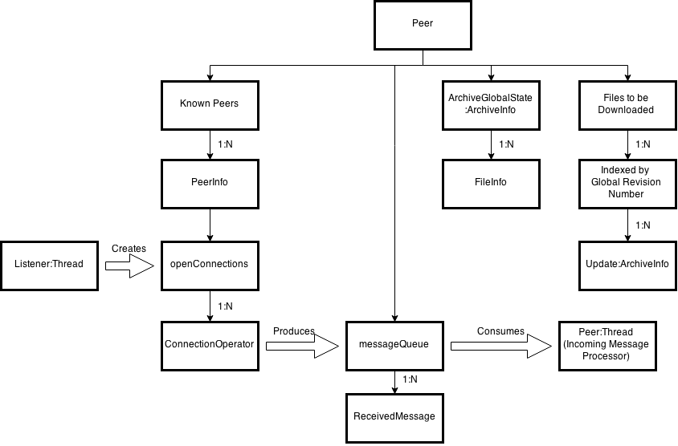

Introduction
============

Note: In this draft version, crossed-out text represent notes and guidance from the intranet site which have not yet been removed.

##Overall Aim of the Project

Distribackup aims to allow normal users of technology to create and manage backups of important family data, without relying on expensive dedicated hardware or transient cloud services.

##Problem Description

Data storage has increasingly become the responsibility of special-interest corporations, who leverage their existing massive server infrastructure (or server infrastructure subcontractors) to reduce the legwork for ordinary consumers wishing to back up their data. The concept of the 'cloud' was invented to further psychologically bolster these data-centres; a fluffy, harmless-sounding term referring to some ethereal space where all your data safely resides.

The reality, as ever, is much less reassuring. Corporations want your data data because, as the old saying goes, information is power. The purpose of this 'cloud' is not to secure average users' data but to generate Big Data (another modern term which refers to a different aspect of the same thing, this one coined by and for cardboard-cutout non-people, greed in suits and economists with dollar signs for eyes), which can be analysed statistically at massive scale, in order to better improve the company's profit techniques. Information of this type is available at such scale that new psychological techniques can be devised to coerce users, such as gamification. More personal messages can be created, using well-educated guesses about the interests and demographics of a portion of the company's audience.

It can be almost impossible to put the cat back into the bag once corporation(s) have dug their heels into an area of human interest -- barring massive governmental intervention, such as internationally-backed legislation. However some things have been shown to be easier to fix than others. The Open Source movement has shown that by initially appealing to users' greed by offering something for which they would otherwise have to pay money for free, it is possible to draw  non-technical users away from for-profit services. The effectiveness of doing this is also strongly influenced by the presentation and appeal of the software, which modern businesses have evolved to take very seriously, creating an entire field called 'brand management'.

Computers have made it convenient to store all our important family data digitally. Family photos, videos, genealogy records, old family recipes; they all take less physical space on a disk, and can be copied easily for anyone interested. However, digital data is at risk of loss (flooding, fire and theft being the most often mentioned), and most homes don't have the infrastructure in place to preserve their family's unique data long-term. Lay users often have little or no idea about where or how their data is stored (on their computer or on the Internet), whether it is safe and whether their rights to it have been compromised by a Terms Of Service agreement (TOS).

##Aspects of the Background 
* why the project is worth doing
* how the project may be useful or helpful for others

Project Goals
-------------

The main objectives of this project are to:-

* Develop a distributed backup syncing program, autonomous enough for non-technical users to be able to use, and efficient enough to run on domestic computer hardware;
* Design and implement an efficient file synchronisation protocol to support this;
* Design and implement a new serialisation suite which is both efficient and succinct for our purposes
    - Write a language-agnostic specification 
    - Implement the specification in Java

TODO: brief chapter-by-chapter overview of the rest of the report

Unique data collections such as photos are often stored on a physical medium which is vulnerable to damage or corruption. CDs are damaged by heat, light and wear and tear. When this storage fails (mobile phones are lost, old PCs break down or are replaced due to age, without sufficiently diligent data transferal), often the user unwittingly throws away or loses many years of irreplaceable data.

Lost laptops and pen drives cause frequent loss of important data. Old PCs being replaced cause families to throw away accumulated personal data, without realising what is stored locally rather than on the Internet -- lack of understanding causes further personal data loss upon hardware failure.

The backup strategy often lauded as the most prudent follows the 3-2-1 strategy: 3 copies, on 2 different storage media, 1 off-site backup.[^backup321] This is an ideal, but is extremely difficult for a home user to set up and maintain, without corporate resources at their disposal. For instance:

* How does one set up backups in different locations?
* How does one sync updates to each off-site copy?

This project aims to answer these questions with a software solution, reducing the risk of data loss for families (and other groups with an interest in long-term data preservation) due to lack of sufficient knowledge and/or funds for more thorough backup solutions, without relying on a third party service that has ulterior motives.

Main Project Features
---------------------

Distribackup watches a directory, keeping its contents synced with copies of the data on other computers. Because the authoritative server broadcasting updates is likely to be a low-end machine, update data will be shared among subscribed peers. In order to expedite large file transfers (which are likely in the primary use case), a differencing algorithm will be used to only send pieces of files that have changed since an update.

This report describes the problem this software attempts to solve and why it is needed, comparing it to related work, and showing how this project builds on this work. It then describes the proposed programme of work to be undertaken in order to complete the bare-bones implementation offered here; continuing by laying out the sub-components of the software, their purposes, and how they fit together to complete the end goal. The methodology will then be explained, describing what software development techniques will be used during the project. This will lead into the proposed evaluation methodology, and how research will be carried out.

The expected time-line for this work will then be described in detail, accompanied by a Gantt chart showing this visually. The report will then finish by listing the resources required in order for it to be completed, and a list of references used.

Abstract
Introduction
Background
Design
Implementation
Testing
Evaluation
Conclusions
Future Work
References

Background
==========

Summary of technical problems and approaches
-------------------------------------------

More than ever before there is a need for long-term backup software which is accessible for everyone. There are now years' worth of data stored digitally which record milestones in peoples' lives, all stored on machines they don't fully understand. This lack of understanding will eventually lead to data loss, but not everyone should be a computer scientist, or even technically capable. But everyone should be able to preserve their family's history.

Relevant work and/or existing related systems
---------------------------------------------

This is by no means an exhaustive list, but discusses the most relevant existing solutions (at time of writing), and describes how Distribackup differs or extends from them.

### Bit-Torrent  ###
* Collection contents cannot be changed after torrent creation
* Unsecure by design (IP addresses and ISP host-names are broadcast and used as identities)
* Nowadays highly stigmatised; associated with illegal activity (copyright theft) in public consciousness

### Bit-Torrent Sync

* Not open source, despite the company's most famous software's background
* Not originally designed for optimal data transfer
    - Differential techniques not used
* Without file differencing, their protocol is inefficient for updates to large files
* Use cases could be very similar to Distribackup's

###Syncthing

http://syncthing.net/

Designed to be an open-source alternative to Bit-Torrent Sync, SyncThing

* No longer part of ind.ie

### Git

Git was designed from the ground-up by Linus Torvalds as a decentralised version control system, competing with Subversion, CVS and Mercurial.

Most developer's contact with Git is through a centralised, authoritative repository, usually hosted by a company such as GitHub or Bit Bucket. However, Git is able to function equally well as a standalone repository or for managing difference relationships between disparate but equally authoritative collections of copies.

Central, authoritative copies of files can be useful when attempting to establish precedence, or evolve a single product towards completion, allowing users to exchange changes with each other through a single point of contact: the Master. This is much easier to conceptualise for users than communicating changes between slightly different repositories, and easier for maintaining a distributable copy for new entrants.

* Updates require user intervention
git updates need to be synced by user, using command line or separate GUI
- Not automatic
- Very hands-on; cannot fire-and-forget

* Large vocabulary of commands to learn
* Assumption of user = programmer
    - unexplained technical concepts

* Git is not visible to end-users: its intended audience is developers, and its steep learning curve (tens of commands to learn each with its own set of single-character optional parameters; a new mental model for manipulating 'staged' files which are 'indexed') would prevent its adoption by non-programmer power users
* Existing GUIs for git are unfinished, non-free, buggy or as confusing as the command line interface, with none of the portability.
* Git is much more complex than is necessary for our task

###Git-Annex

Git-Annex, and its GUI front-end Git-Annex Assistant allow the user to manage collections of large files using git, without checking the file contents into git.[^git-annex]

Git-annex is aimed towards a more technically literate user. Also, as with Sparkleshare, a central server is needed to manage and distribute changes between different storage nodes.

###Ceph

Ceph is a distributed file system. Designed for use with Storage Area Networks and other types of dedicated file storage hardware, Ceph is aimed more at technically proficient users and industry professionals.

###Tahoe-LAFS

Tahoes-LAFS (Least Authority File system) is an open source distributed file system, focused on providing self-hosted cloud storage that is resistant to attack.[^tahoe1page] This, again, is aimed much more at system administrators and other professionals with an understanding of the area.

###Sparkleshare

Sparkleshare[sparkleshare] is also an open-source cloud syncing solution with the intention of providing an alternative to DropBox. 

Sparkleshare is backed by Git and SSH, and is well suited to managing a collection of many regularly-changing small (mostly text) files which are edited by a group, such as in a software development team.[^sparklegood] However, by its own admission Sparkleshare is not well-suited to full-computer backups, or for storing large archives of binary data such as photos and videos.[^sparklebad] Sparkleshare also relies on a centralised server to manage backups, which introduces an infrastructure overhead (including setup time and maintenance) which this project aims to avoid.

### MogileFS

Complex conceptual structure
Multiple types of mirror nodes

### DropBox

DropBox is an extremely popular solution for accessing data across multiple machines, and sharing files easily with small groups of people. As convenient as DropBox is, there are downsides:

DropBox is useful for keeping files synced across multiple machines; but by using their service, DropBox can stake a claim to your data.

* Their encryption model is not published, has been proven to be unsecure in the past[^dropbox-secpaper]
* They have repeatedly leaked sensitive data, only remedying the problem after being notified by third parties[^dropbox-security1] [^dropbox-security2] [^dropbox-leak]
* Data may be used for undisclosed purposes
* You can't be sure they've really deleted something[^dropbox-hoard]
* If you stored the source code to a commercially interesting piece of software (something that could make money), DropBox could feasibly contend the Intellectual Property rights
* The maximum capacity and file sizes are very low, which restricts its usefulness.
* DropBox are required by law to hand over data to governmental bodies (including overseas agencies such as US intelligence). In an age of controversial laws (legislate first, ask questions later)[^prism], this is problematic
* DropBox also reserves the right to share certain personal information with other companies, whose own security may be insufficient[^dropbox-privacy]

### Other Commercial Solutions ###

DropBox has been examined individually due to its popularity; however some general disadvantages apply to all third-party commercial solutions:-

Other commercial solutions (such Amazon S3) entrust critical private data within large hosting data-centres. These data-centres are large targets for attack. They:

* can be damaged or hacked
* carry a risk of loss of ownership or Intellectual Property rights (Terms Of Service agreements often can change at any time, with or without notice)
* hand over information to governmental bodies with dubious jurisdiction[^ms-dublin-usgov-handover]

Implications For This Project
-----------------------------
 
None of the existing storage solutions are robust enough to use for long-term archival data.

Existing backup solutions are commercially available, and can come with very restrictive space limits, or require that the user allow the data to be used for marketing purposes (e.g. photos from a birthday party used in advertising without explicit permission). A software system which allows lay people to set up extremely robust backups of data that can't be replaced.

Data is stored on third-party server farms. These are vulnerable because they can not only suffer the same physical damage (floods, earthquakes, fires) as all data, but may also be actively targeted by governmental groups (FBI seized all MegaUpload files during their raid, including files of legitimate users who had paid for storage)

Governments seize data wholesale from sites (like MegaUpload), stealing both pirated material and legitimate data indiscriminately in the name of anti-copyright theft. This means that any personal information which happens to be stored on the same site as  in large centralised data centres is at risk.

The storage is run by a company, whose primary motivation is to make a profit; the agreement you sign may allow them to mine your data for information useful to them (e.g. using your photos as marketing material).

###Any improvements that your system offers
###shortcomings that your work addresses, and so on

##Justify your choice of platform, software, solution etc

pandoc -c style.css -sN -r markdown+pipe_tables -w html -o report.html report.md
Design
======

~~Major design decisions and justifications. System architecture, etc. Use supporting figures where appropriate and helpful. A diagram of the overall architecture is essential. Each component in the architectural diagram should be briefly discussed. Other designs that may be important are class hierarchies and initial user interface designs. Take care to describe any design work in reasonably high level terms, and do not stray into implementation details. Make sure that you explain to the reader how to interpret any design notation that you use (e.g. a key in the relevant figures), unless you are using a standard notation (such as UML).~~

* Will not require an always-on machine - will reliably and efficiently (but not necessarily quickly) sync mirrors.
* Not intended for real-time sync
* The system will work best with infrequent updates among sometimes-on machines that form a network with common up-time
	(i.e. each mirror is on at the same time as at least one other machine, to pass updates)
    - a Raspberry Pi could bolster this and speed up full network sync, but should not be necessary.

As a bare minimum interface (all of which will be optional, and will default to sane values) users will be given the following choices:-

* a folder they wish to keep synced
    - Creating a new network with this folder, or adding it to an existing network
        * Joining an existing network will require some kind of network identity key as a minimum. See Aims and Objectives.
* a maximum size limit of data to sync (optionally no limit)

Features and General Design Intentions
--------------------------------------

Distribackup's intended primary use case is for synchronising backup copies of large, rarely-changing binary files such as images and videos. This means that design decision have been chosen in order to optimise for networks with low common up-time, such as a collection of commodity computing hardware: a family's PCs, laptops, tablets, and phones.

While specifying planned features, it was necessary to keep in mind that the aim was not to create a source code management system. Plenty of such software already exists, which in the author's opinion is perfectly adequate  -- making such a task unnecessary. Furthermore, if this project was implemented properly, it would be possible to use existing source-code management solutions on top of the archive system (by including the SCM's repository meta-data in Distribackup's archive), creating a mirrored, versioned backup.

Changes to files are not be grouped into discrete updates which are pushed to the file system in one go; changes appear as soon as they are downloaded, and the new version of the file is complete. This per-file updating (as opposed to per-group updating) would affect collections of interdependent files, such as a website or source code, but it matters little to the files in our intended use case.

Many similar projects emphasise their network's resistance to attack and take-down requests, using a variety of encryption, trust-based connections and decentralised network architecture. The last method, decentralisation, is a popular one, as it ensures that there's no central point to fail/be attacked for the network to fail. This kind of robustness against failure is high desirable in a system designed for long-term data security.

However designing a photo/video sharing and backup solution which is easy for a normal user to manage often translates to using a single conceptual focus point (such as a company server), which is simpler to understand than a self-organising network of inter-connected devices. Also, as discussed earlier during the Background, decentralised networks can be poor at maintaining a single authoritative copy of the file or archive. From a distributed standpoint, it can also be difficult for peers to know which other peers in the network have the desired file or version of the file, without transferring it and checking. Working out which copy of files a new peer entering the network should have can be equally challenging.

In order to reconcile these two design perspectives acceptably -- without compromising the fault-tolerance of decentralised networks, or the low barrier-to-entry and authority of centralised systems -- it was decided to use a Publisher-Subscriber network model, where the Publisher is the only peer with the authority to make changes to the synced files. This Publisher itself contains no unrecoverable information, and in the event of the loss of the Publisher, a new one can be selected, or even created from scratch, and given proper authority.

One-Way At A Time Sync: the Central Publisher
-----------------------------------

In order to minimise network and design complexity, Distribackup's network architecture is designed around the idea of a single Publisher peer, who announces updates to the mirrored files. Only the Publisher has the authority to make changes to archive. This avoids problems such as multiple concurrent versions of files, implementing remote diffing (such as increasingly outdated rsync, bsdiff -- whose final algorithm version was close-sourced after the end of Colin Percival's PhD -- or Microsoft's proprietary Remote Differential Compression) and network bottlenecks from transferring edits from a single peer.

Consider adopting 1-way synchronisation with a star topology, with one node in the middle pushing updates to interested subscribed mirrors
(who share update pieces amongst themselves to speed things up & reduce publisher's load)

* updates to mirrors, which cannot modify the files - "spokes in a wheel"
* what about if we share photos with a phone, which we then lose? what happens to folder ownership?
* using top-down star topology doesn't rule out distributed chunk trading amongst receiving peers

In our case, each folder will be its own spoke, representing a collection of data (photos from one 
day out) belonging to one participant.
"Pushing" this spoke's updates is sharing this data collection with viewers.

Downside is, the system isn't as decentralised; we rely on a central Publisher

The difference between remote copies and the new copies in the spoke is always known, as the remote files are the same as the spoke's file pre-change
We don't need to solve rsync's diff between remote files problem, we can just use a normal diff algorithm

publisher authority (ie which mirror can update the network) can be controlled with an arbitrary token, eg an RSA key or password

* allowing us to move the publishing mirror dynamically
* which moves us back into the use-case area of 1 person, many machines like DropBox!
* something like ssh private key? possibly a password? should be something. intangible, portable
* this has the bonus of being conceptually easy for lay users to understand

when there's a new publisher,

* each node can choose to join the new version of this swarm, or stick with the old, static one
* Subscribers sticking with the old Publisher can serve common files (while there are files in common) to other subscribers in both swarms 

With this star topology, we are enabling the possibility of a decentralised publishing platform - self-hosted web pages with built-in scalability

Choosing Which Peer to Request a File From
-------------------------------------------

The selection process for choosing a peer to request (and hopefully download) a file from affects the performance of the network. Ideally, the request should be sent to a node which:-

1. Has the file being requested
2. Has the lowest network traffic relative to other peers
3. Has the highest bandwidth connection to the network

The publisher is by definition guaranteed to have the file, however if all subscribers were to favour downloading from the publisher then this would eliminate the peer-to-peer aspect of the network, creating a traditional server-client network, with the publisher as a large bottleneck.

The publisher is always the busiest peer, as it must upload a copy of every change to at least one other peer (likely to be more), along with network housekeeping messages such as update announcements. Other subscribers aren't guaranteed to yet have the file being requested, which means multiple requests may need to be sent out.

Requesting a file from every other peer (flood-requesting) would create a lot of redundant traffic, which could cause network congestion, along with inflating the bandwidth requirements for using the software.

The current implementation chooses a random peer to request the file from (in order to distribute network load across the network evenly), sending another request to a different peer if the first declares that it doesn't have the file. However this algorithm this could be optimised in later versions to use collected network meta-data such as connection bandwidth to select a more suitable peer.

Handling Incoming Messages
--------------------------

* a queue of enums which each represent incoming events 
* a single event handling thread deals with each event in order
* each event enum will need info about it attached, like WHICH peer announced its exit
* connection operators receiving bytes (which they then decode into messages) will add to the queue

Each Peer has its own UUID, generated during first run and stored on-disk

Gathering user input may be implemented using some kind of GUI, such as a wizard.

#Scenarios (Use Cases)

* Setting up a new backup network
* Adding new mirrors to an existing network
* Propagating updates from one mirror to the whole network
    - Deletion of existing files
    - Changes to an existing file
    - Addition of new files/folders
    - Adding new data (en masse) to network
* Provision for dependencies -- ie you can't delete the film without deleting the subtitles as well?
* Prioritise updates to and from low up-time mirrors - ie granny's laptop she uses once a week
* Organise p2p traffic based on measured speeds of mirrors

For each update between a sender-receiver pair:

Collect multiple rapid-fire updates into one network transaction (minimise network overhead due to tiny updates)

* Diffchecking phase
* Diffchunk sending phase
* Reassemble new version from diffchunks + original
* Sync check

	Upon start-up:
	mirror discovers others using DHT as overlay network

	Upon a file change:
	Inotify alerts of file change
	
	if a file has been deleted:
		if file is confirmed to exist on other mirrors
		and is identical on other mirrors,
			then a deletion announcement is sent through overlay network to other mirrors

	if a file is added:
		rsync is used to find which mirrors don't have the file
		file is sent via p2p implementation to any mirrors which don't have the file (or a piece of it)
		
	if a file is updated:
		rsync diffs these changes against copies on other mirrors
		differing chunks are sent via p2p implementation

Intelligent handling of renamed files will depend on inotify (and the java binding library), and whether it can detect file moves.

We're using computing time to reduce bandwidth usage
It may be useful to store state (or diffs) of file-system -- the old state of the files, to compare against changed files, and filter for small changes and mind-changes

#Optional Extras (if have time)
* Android Client
* Windows Client
* Merging conflicts
* Edit locks

Further Work (Not Implementing in this Development Cycle)
---------------------------------------------------------

* Web-visible files - hosted web pages and web links to files
* Web interface
* Version control for managed files
    - Likely to be implemented using Git
* GUI
    - stick to a daemon (and setup wizard?) with a configuration file for now
* Fine-grained file subscriptions
    - mirrors only host files they're interested in
    - Risk of low availability for undesirable/unpopular files - bad
* Merging conflicting file updates automatically (modification times, diffs, git?)
* Multiple networks, multiple folders in each
    * This could get complex for the user very quickly
* Encryption [^PGP] - this can be broken into 3 sub-areas; PGP is a good candidate for providing any of these.
	All of these, though especially the first two, are highly desirable, and may become core goals during the course of the project.
	- Transfer encryption - preventing digital wire taps from snooping on data being transferred is extremely important, especially given the use of a public network (the internet) as the transmission medium.
	- Authentication - prevent attackers from joining the network without permission.
	- Local storage encryption - Focus on interfacing with existing file-system encryption technology here
* Human-readable anonymous peer IDs
    - map IP address of a peer to a country,
    - then hash the peer's UUID to choose a name from a list specific for that country

Implementation
==============

Overview of implementation
--------------------------

Describe implemented features, compare with original goals

Structure of Functional Components
----------------------------------

##Functional Components (as described in Proposal):

* Peer discovery - given that peers have dynamic IP addresses and <100% up-time?
    - use DHTs eg Kademlia
        - is DHT mirror discovery too difficult to implement in the given time?
* Identifying/authenticating mirrors - preventing man-in the middle attacks
    - use SSH authentication model
* Implementing p2p file transfer - a la bit torrent
    - downloading a file from multiple peers at once by splitting into file pieces
        - will be heavily related to rsync-derived algorithm 
* Sending file changes only
    - look at rsync algorithm, remote differential compression, diff, bsdiff, chromium's Courgette[^courgette]
    - Process edge-case file updates efficiently - eg renaming a file, swapping file piece order
* Detecting changes rapidly
    - using Inotify? (Linux systems only)
* merging conflicting versions - just do what DropBox does and rename conflicts /create copies
* Working out which files and versions are most up to date -  propagating most up-to-date file
* Obtaining an open outgoing port - UPnP?

The original design comprised 5 major functional components:-

* Socket Connections Manager
    - Manage open connections
    - Handles all low-level network housekeeping
* Peer
    - In the star trek metaphor: the comms officer between this and other ships, AKA external comms/foreign minister
    - manages list of:
        * Seen mirrors, their MAC addresses and current IP address (and possibly another unique identifier)
        * Last seen and average common up-time
        * Also sends heartbeats to all known online mirrors
* File-System Watcher
    - Uses inotify on Linux & android
    - Triggers events which start the sync process
* DHT Manager
    - Talks to and provides a portion of the DHT
    - Interfaces between other components and the distributed data
    - maintains a local copy of the table? probably has to
        * Freshness rating?
* Rsync Diff Chunker
    - Calculates rsync diff sums against each other known online mirror (provided by Peer Manager)
    - tightly coupled with Peer Manager, as different diffchunks may need to be sent out to each mirror, as each mirror may itself be unsynced to every other (worst case). 
    
However, during the course of implementation, the working design evolved away from several of these.

The Rsync Diff Chunking functionality was no longer needed after the network architecture was changed to the Publisher-Subscriber model. All differences were made predictable without using the rsync windowed hashing technique to measure differences across a network: Subscribers only have older versions in a linear succession of versions, rather than having a related but possibly divergent copy with its own changes in a tree.

The design prototype implemented for this project does not include functionality for peer discovery using DHT or any other techniques. Currently, peers share information about other peers that have already connected at least once to the network, and peers are also announced to the whole network once they initiate a connection to any member. However there is no way for the network to actively discover peers which have not initiated a connection.

This functionality is planned to be implemented in the future, however it was not considered necessary in order to create a working prototype of the core syncing functionality.

The Filesystem Watcher component was implemented using Java 7's new Paths API, which allows registering directories to be watched for changes. However, Filesystem Watcher internals are confined to a single class, so could be replaced by an implementation which uses a different underlying system. This allows the future support of Android, whose Java-like API Dalvik forked from Java before the release of Java 7, and which would have to rely on another mechanism to provide filesystem watching, such as the previously mentioned Inotify.

Binary Messages
---------------

In order to provide for efficiency of communication between nodes, it was necessary to create a custom communications protocol. Existing formats were inefficient for network transfer, did not implement required features or were overly cumbersome to develop with. 

The requirements for our serialisation format are that it should be able to store both binary data and network control messages using universal data types which have analogues in many common programming languages, such as 8, 16, 32 and 64 integers, booleans and Strings.

floating-point types were not included in the specification, because they were not needed for Distribackup's purposes, however they could be included and implemented in future protocol versions if the need arose.

Before creating this protocol, several existing alternatives were looked at, to ensure that creation of a custom protocol was necessary.

###JSON

JavaScript Serial Object Notation is a plain-text, human-readable data storage and interchange format which is rapidly gaining widespread acceptance as a common data format. Less textually redundant replacement to XML, it is often found in places where data needs to be read by both humans and computers, such as in a configuration file, or in places where a common data interchange format (which is less heavyweight than something like CORBA) is needed for data exchange between programming languages.

JSON can only store data which can be represented in plain text. Ruling out embedding binary data in JSON files using plain text encoding formats such as base64 or yEncoding (which are storage-inefficient and require processing overhead), BSON was next examined as a candidate.

####BSON
  Binary Serial Object Notation is a specialised sub-format of JSON, which allows embedding of serial data alongside normal JSON.
  
###Bencoding

Bencoding is the serialisation format used by bit-torrent applications. Although widely in use, its design is surprisingly network inefficient, storing number values as plain-text representations.

###Java's In-Built Serialisation API

Although requiring no external libraries to use in Java, objects encoded in Java's own serialisation API would be more difficult to decode for clients not implemented in Java.

Furthermore, it has been designed with several layers of abstraction which are specific to Java's approach to distributed systems programming, which also do not port well to other languages.

Finally, the serialisation API has been found to generate significant amounts of boilerplate code in order to set up and manage, introducing subsystems which may function differently between differing Java implementations (Oracle Java 6, 7 or 8, and GNU Classpath) creating undesirable complexity in system architecture and code-base maintenance.

Other Java serialisation libraries have been created to replace this relatively clunky functionality, such as the Kryo[^kryo] library, but the Swiss-army-tank design of this project was deemed too heavyweight for this project.

###Type Length Value

Less of a concrete data format and more of a design pattern, Type-Length-Value is the idea of storing each message as a fixed-length id header, a fixed-length message-length field, followed by length bytes of payload.

###Named Binary Tag

An application of the Type-Length-value design, Named Binary Tags are a binary data serialisation format originally created by Mojang AB to describe player data and world content. Although poorly-specified and susceptible to design changes without warning, the core of NBT has proved to be well-designed for efficiently storing binary data and its describing metadata.

Distribackup's Custom Binary Communication Protocol
---------------------------------------------------

After reviewing the existing serialisation software as detailed above, a decision was made to implement a new protocol which took inspiration from several of the projects. This new Data and Network Information Exchange Protocol (or DNIEPr) would be able to provide all of the requirements that emerged from studying the features and downsides of existing solutions.

* The protocol shall make efficient use of network bandwidth, eg by encoding data in succinct Messages. 
    * Resistance to message corruption shall be provided by the underlying TCP protocol.
* The protocol should be specify a clear, unambiguous API easy to work with from

###ID Bytes

Each Object type has an ID byte, followed either by its payload (for static-length types)
or a length int (without the int type header attached, because we know what should 
follow for a certain message type), followed by its payload.

Objects inside a compound object don't need an ID byte; their type is known from the object's structure definition.
Variable-length types (such as strings) still need their length field though.

Message Lengths
---------------

Message types with a static payload length (eg bitfield, ULong) don't have (or need) a length attribute. Their length is built into the spec.

Variable-length homogeneous types (String, Byte-Array) are TLV; see below.

TLV
:   Type Length Value, a simple way of defining variable-length types such as Strings. Length is a Int: 32-bits, 0 to 2^31 -1. Changed from unsigned int due to Java array addressing limitations.

TNV
:   Type Number Value. An different field for array types, specifying how many elements there are. Useful for progress estimation, or simple iteration

Supporting Data Types
---------------------

The following Objects are not used as standalone Messages by Distribackup, but instead form part of compound Messages, and so are generally used without their ID Byte. Despite this, an ID Byte number is assigned for each in case this situation changes, or another program uses this library differently.

ID byte | Name  | Payload length in bytes | Is Compound / Notes
---|------------|-------------------------|-------------|
00 | bitfield              | 1     | Contains up to 8 booleans. Knowing which bits are used is left to implementation, but start with the least significant bit
01 | String                | TLV   | UTF16; but length field is still in bytes. So chars = length * 2. |
02 | UByteNum              | 1        |   |
03 | UShort                | 2        |   |
04 | UInteger              | 4        |   |
05 | ULong                 | 8        |   |
06 | ByteNum               | 1        |   |
07 | Short                 | 2        |   |
08 | Integer               | 4        |   |
09 | Long                  | 8        |   |
0A | Address               | Compound | [Yes, see below](#Address) |
0B | ByteArray             | TLV      |   |
0F | FileInfo              | Compound | [Yes, see below](#FileInfo) |
0E | List                  | TNV      |   |

\newpage

Sendable (Communicable) Message Objects
---------------------------------------

These objects can be sent directly to another Peer.

ID byte | Name  | Payload length in bytes | Is Compound / Notes
---|------------|-------------------------|-------------|
0C | PeerInfo              | Compound | [Yes, see below](#PeerInfo) Can be sent in reply to a PeerInfo Request |
0D | Archive Status        | Compound | Same type as update announcement, but with a different IDByte: [FileInfoBunch](#FileInfoBunch). A reply to Archive Status Request
10 | Request For Peers     | 0/TLV    | Can have no payload (length 0), or List of UUIDs of peers already known 
11 | Request All Files     | 0        | Asks for latest known version of all files. Likely to be broadcast by a new subscriber, to all known peers.
12 | File Data Chunk       | Compound | [Yes, see below](#FileDataChunk)
13 | File Request          | TLV      | Contains a single FileInfo. FileInfo's RevNum (Revision Number) can be for a specific version, or -1 for latest version
14 | Greeting              | 16       | Contains UUID(long msb,long lsb). If UUID is unknown to receiver, it may request the sender's PeerInfo
15 | Exit Announcement     | 0        | Usually sent to all known peers
16 | Archive Status Request| 0        | Queries overall archive status, not any 1 peer's mirror
17 | Update Announcement   | Compound | Same type as Archive Status, but with a different IDByte: [FileInfoBunch](#FileInfoBunch). Sendable by Publisher only.|
18 | "no haz" FileReq Reply| Compound | Used as a reply to a File Request when a peer doesn't have a (version of a?) file requested of it. Contains a list of FileInfos that the requesting peer asked for, which the replying peer doesn't have. 
19 | PeerInfo Request      | 0        | A request for the connected Peer's PeerInfo
1A | "haz nao" announcement| Compound | Announces to network upon completion that this peer now has this FileInfo, so others can request it. Contains a list (usually of length 1) of FileInfos of file this peer now has
1B | More Peers            | Compound | Contains a List:PeerInfo. Is a reply to a request for more Peers.

Main Data Structures
--------------------

~~Really important implemented algorithms may be included (maybe in the form of pseudo-code), but do not include actual code, except for very small portions of code that represent a solution to a particularly interesting or difficult problem (even then, pseudo-code is better). Again, use figures as appropriate, e.g., to support discussion of communication between main procedures/methods in terms of procedure/method name, parameters, result type, function, relationship to other procedures/methods and so on.~~

The system in operation/Process description
-------------------------------------------

Common Scenarios
----------------

###Definitions

P
:	the publisher
	
S
:	a new subscriber

###Peer Starts Program Up (Not First Time) AKA Old Subscriber Joins Network

1. Peer checks integrity of file tree by checking against stored values of size, name, checksum for every file
2.      If there are discrepancies:
            and we're a Subscriber:
                see Subscriber Loses Some Or All of Local Copy.
            or if we're the Publisher:
                see Publisher Has Updates
        else no discrepancies:
            If we're a Subscriber:
                check with Publisher about new peers and file updates
            Or if we're the Publisher:
                check if any new Peers have joined via DHT or otherwise

###New Subscriber Joins Network

1. New subscriber S connects to publisher P on P's listening port
2. P and S exchange version numbers; if they don't match, disconnect and warn users at P and S
2. P and S exchange UUIDs. These will later serve as keys, mapping to PeerInfo objects.
3. S sends P PeerInfo of itself, containing relevant info (see message binary spec)
3. P sends S a File Tree Status object, informing S of the latest versions
4. P sends S a PeerInfo List of the peers it knows about (hopefully all of them)
5. S Greets peers it heard about from P, sends File Requests for files/versions it doesn't have
6. Peers send back list of requested pieces they have/are able to send
6. S chooses best peer to download each file or piece from, based on speed or other metrics
8. Some kind of sanity check is performed to make sure everything went OK

###Publisher Has Updates to Push to All Subscribers / Publisher Adds Files

1. P announces to all known peers the changed file revision numbers (partial file Tree state info)
1. If P has any data about bandwidths of various subscribers, the files are sent to the fastest first, to maximise the number of peers that can supply the file. If not, a random subscriber is chosen
2. Every time a subscriber finishes downloading a file, it announces to peers it hasn't heard the same announcement from.
3. For every subscriber still downloading the file, requests are made for that file to those who have it.
3. Data is gathered by every peer about speeds during the transfer

###Subscriber Leaves Network Gracefully

1. Exit announcement is made to all known peers
2. Any transfers this subscriber has in progress are finished, or if they'll take too long (which is how long?), cancelled
3. Sockets etc are closed
4. Peers set their record for this Peer as 'offline'

###Subscriber is in the Middle of Downloading a FileInfo, When a New Version is Announced

###Publisher Leaves Network Gracefully

the publisher may intend for the files to remain static, so a new publisher won't be elected unless (good_reason).
any new peer which joins by contacting a peer will be brought up to date by the network
(version check, file list exchange, sync files with p2p)
once (if) it's implemented, peers may also find the network by DHT.

###Subscriber Disappears Without Saying Goodbye

1. Subscriber fails heartbeats on each peer individually; each per individually marks it as offline in its local peer list.

###Publisher Disappears Without Saying Goodbye

###Subscriber loses some or all of local copy, subscriber erroneously edits local copy

1. The user is warned that this is a bad idea: any changes will be overwritten. If they want to edit the files, then they should make a copy
2. Procedure for 1 out-of-date peer is followed
3. Request more peers and files from all known peers
1. Subscriber announces its loss 

###publisher loses its files

####publisher loses its files while network has differing versions unresolved

situation is resolved by using file revision numbers (every update or transaction if given a number, so with conflicting updates, the later number will take priority) to bring all peers, including the Publisher, up-to-date

1. Peers exchange information about the latest updates they've seen, until they are all in agreement.
2. updates which conflict are weeded out, and a list of updates which need applying to the network is created
3. Peers which have part or all of this update send what they have to everyone else

###Complex states with no intuitive solution

* a token, key or password is used by a peer to become the new publisher (P2)
* Another peer becomes the publisher P2 while the old publisher (P1) is propagating updates
* subscriber checks (with publisher or publisher-checked peers) that files are up-to-date
* Publisher can't access a subscriber, but others can
    * From the perspective of this weakly-connected peer S, the publisher is down
    * From the publisher's perspective, the peer has disappeared without saying goodbye (timed out)

There are common procedure to follow for some of these events:

####Generalisation: One Out-Of-Date Peer

For example:

* new peer joins network
* peer loses its files (they are deleted, disk corrupt etc)
* subscriber erroneously edits files

#####Procedure:

1. Out of date Peer P asks the publisher for the current revision number for every file in the tree, along with their checksums, size, and names
1. P asks all known peers for more peers (in case its local peer list has been partially or wholly corrupted), and files (filtering any which aren't as high 

(Note: possibly two chapters):

~~Give the reader a feel for what the system is like to use (this may only be really relevant if the system has a user interface). Use screen dumps to illustrate - textually quite a short chapter, maybe just a walk-through of the main features of a typical session with the system. Note that this is not a user manual. You aren't showing the reader how to operate the system, but rather what it's like to use. As a separate chapter, you may also need a process description of your system, so that the reader can appreciate how the system works. This is not the same as the walkthrough described immediately above. It should be a description at a higher level than the code itself. Use supporting process diagrams as appropriate If your system has a significant user interface and a complex underlying system you may need both a walkthrough and a process chapter.~~

Testing 
=======
~~Testing is intended to establish that the system functions correctly.~~

Evaluation
====================

~~How you evaluated the system, how you designed the evaluation
Evaluation examines how well the system achieves its aim.~~

The main competitors to to this software are Bit-Torrent Sync and DropBox, due to the similarity of their technology compared to this project. Although the primary intended use of this software is for backup, these technological similarities along with the popularity of DropBox will mean they will offer direct competition.

* Is the system user-friendly?
* Is the system cross-platform?
    * HOW cross platform? (Linux, Windows, Android...)
* Is the system resistant to attack?
    * random peers going down
    * Publisher impersonation/spoofing
    * archive status misinformation
* How well does the system cope with sudden changes in network topology?
* How efficient is it? (bandwidth usage, processor & memory usage)
* completeness of the API
    * lack of ambiguity

Results of the evaluation
-------------------------

* ~~A critical review of the evaluation itself~~
* ~~how well it yielded the info you wanted.~~

~~There may be a need to have two chapters, one on testing and one on evaluation.~~

~~For a system that features a user interface, some kind of user interface evaluation is very important. For testing and evaluation, you must include descriptions of the methodology and metrics used. Tables of results may be included (main results can be summarised if a large amount of test data was accumulated). Make sure you discuss interesting and important results indicated by the data. Make sure you summarise your overall findings, including statistical evaluation, and describing methods.~~

Conclusions
===========

~~VERY important chapter. Revisit your objectives from chapter 1, for each, analyse whether the project met that objective, and if not, discuss this, and suggest a solution. Discuss the project as a whole, if you did it again would you do it differently? What did you have to learn to do the project, what did you learn from doing it? What features would you add to your system if you had more time etc? Some suggested subsections for your concluding chapter are: Review of aims; Suggested revisions to design/implementation; Future work (possible developments of existing system); Lessons learned. Finish the concluding chapter with a brief, fairly upbeat overall conclusion on the project as a whole. Even projects that are not an overall success usually achieve something, and you acquire skills and knowledge from doing the project. End on a positive note.~~

References
===========
[^backup321]: "Backups with the 3-2-1 rule" (http://blog.wisefaq.com/2010/01/05/backups-with-the-3-2-1-rule/) (accessed 25/06/2014)
[^wang13]: Liang Wang and Jussi Kangasharju, "Measuring Large-Scale Distributed Systems:
Case of Bit Torrent Mainline DHT", 13-th IEEE International Conference on Peer-to-Peer Computing
(http://www.cs.helsinki.fi/u/lxwang/publications/P2P2013_13.pdf) (accessed 19/06/14)

[^tahoe]: http://tahoe-lafs.org/trac/tahoe-lafs (accessed 24/06/2014)
[^tahoe1page]:"Tahoe one-page summary" (https://tahoe-lafs.org/trac/tahoe-lafs/browser/trunk/docs/about.rst) (accessed 24/06/2014)
[^MogileFS]: http://code.google.com/p/mogilefs/ (accessed 25/06/2014)
[^ceph]:http://ceph.com/(accessed 25/06/2014)
[^sparkleshare]:http://sparkleshare.org/ (accessed 25/06/2014)
[^sparklegood]:http://sparkleshare.org/#good (accessed 25/06/2014)
[^sparklebad]:http://sparkleshare.org/#bad (accessed 25/06/2014)
[^git-annex]:Joey Hess, "Git Annex" (http://git-annex.branchable.com/) (Accessed 25/06/2014)
[^dropbox-secpaper]: Dhiru Kholia and Przemysaw Wegrzyn, "Looking inside the (Drop) box", 7th USENIX Workshop on Offensive Technologies (http://0b4af6cdc2f0c5998459-c0245c5c937c5dedcca3f1764ecc9b2f.r43.cf2.rackcdn.com/12058-woot13-kholia.pdf) (accessed 24/0/2014)
[^dropbox-security1]: Matt Marshall, "Dropbox has become 'problem child' of cloud security" (http://venturebeat.com/2012/08/01/dropbox-has-become-problem-child-of-cloud-security/)(accessed 25/06/2014)
[^dropbox-security2]:Derek Newton, "Dropbox authentication: insecure by design" (http://dereknewton.com/2011/04/dropbox-authentication-static-host-ids/)(Accessed 25/06/2014)
[^dropbox-leak]: Graham Cluley, "Dropbox users leak tax returns, mortgage applications and more" (http://grahamcluley.com/2014/05/dropbox-box-leak/)(accessed 25/06/2014)
[^dropbox-hoard]: User 'IsThisTheRealLife', "DropBox is keeping 'permanently deleted' files for longer than the 30 day recovery limit.", (http://www.reddit.com/r/privacy/comments/1m60yp/dropbox_is_keeping_permanently_deleted_files_for/)(accessed 26/06/2014)
[^prism]:The Guardian, "The NSA Files" (http://www.theguardian.com/world/the-nsa-files)(accessed 25/06/2014)
[^dropbox-privacy]:"Dropbox Privacy Policy", (https://www.dropbox.com/privacy)(accessed 25/06/2014)

[^ms-dublin-usgov-handover]:Margi Murphy, "Microsoft must hand over customer data held in Dublin to US government" (http://www.computerworlduk.com/news/security/3514076/microsoft-must-hand-over-customer-data-held-in-dublin-us-government/)(accessed 25/06/2014)

[^raspi-java]: Eben Upton, "Oracle Java on Raspberry Pi" (http://www.raspberrypi.org/oracle-java-on-raspberry-pi) (accessed 24/06/2014)
[^git]:"Git Website" (http://git-scm.com/) (accessed 24/06/2014)
[^rsync-tech]:"The rsync algorithm" (http://rsync.samba.org/tech_report) (accessed 24/06/2014)
[^rsync]:"Rsync" (http://rsync.samba.org/) (accessed 24/06/2014)
[^bt-protocol]: "The BitTorrent Protocol Specification" (http://www.bittorrent.org/beps/bep_0003.html) (accessed 24/06/2014)
[^courgette]:http://dev.chromium.org/developers/design-documents/software-updates-courgette
[^inotify]: "inotify(7) - Linux man page" (http://linux.die.net/man/7/inotify)(alternatively try "man 7 inotify" on linux systems)
[^FileObserver]:Android API Reference, "FileObserver Class" (https://developer.android.com/reference/android/os/FileObserver.html) (accessed 24/06/2014)
[^PGP]:"Pretty Good Privacy" (http://www.cryptography.org/getpgp.htm) (accessed 24/06/2014)
[^Percival06]: "Matching with Mismatches and Assorted Applications" (http://www.daemonology.net/papers/thesis.pdf) (accessed 05/03/2015)
